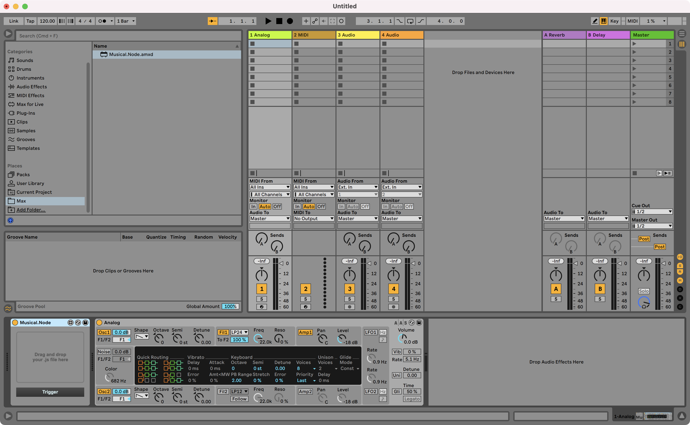
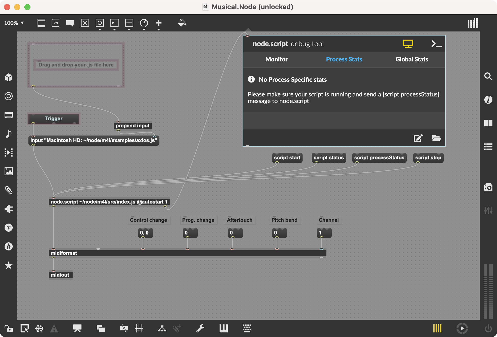

# What Does the Event Loop Sound Like?
A musical journey inside Node internals
https://medium.com/att-israel/what-does-the-event-loop-sound-like-b571abaa3562

# Build Nodejs
See [BUILDING.md](https://github.com/ronenlh/node/blob/musical-node-2/BUILDING.md "BUILDING.md") for instructions on how to build Node.js from source and a list of supported platforms.

# Get Ableton Live Suite
Get all the features of Live 11 Suite free for 90 days. https://www.ableton.com/en/trial/ (I'm not sponsored).

# Import Max Plugin
On Live's Browser, click "Add Folder" and add `node/m4l/Max/` from the repository. You should see `Musical.Node.amxd` in the sidebar.

Drag and drop the file into the bottom bar.

Next to it, drag and drop an instrument from the "Instruments" category in the browser. To connect to an external MIDI instrument (with a MIDI cable) you can select "External Instrument."

Drag and drop a javascript file into the Plugin, and click "Trigger."

# Edit

To edit the plugin, click on edit button above the plugin window. A Max for Live patcher window should open up.

Disable "Presentation Mode" by clicking the bottom active yellow button to see the innards of the patch.

# Warning

When tinkering with sound, it’s very important to output things at safe levels to avoid damaging one’s speakers or worse: hearing.
